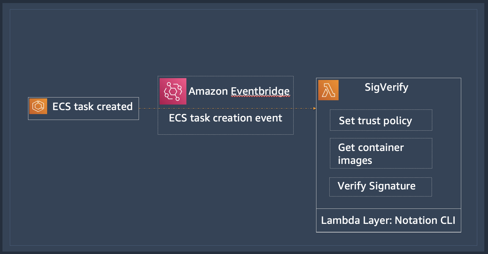

# Lambda function to verify container image signatures
In this repository we provide sample code for a Lambda function called *SigVerify* that can be used to verify signatures on container images. The signatures should be created and signed using AWS Signer, which recently added support for [container image signing](https://aws.amazon.com/about-aws/whats-new/2023/06/aws-container-image-signing/). The Lambda function uses Notation CLI to verify the signatures on ECR container images.

We have created SigVerify so that ECS customers can verify the container images associated with tasks whenever a new task is created. ECS tasks can be created through `run-task`, ECS service creation, or ECS service update. Whenever an ECS task is created, ECS publishes an event to Amazon Eventbridge which has details of the task including all the container images associated with the task. This event can be used to trigger the SigVerify Lambda function and verify signatures on the task container images. 


## Getting Started
### Prerequisites
* [Latest AWS CLI](https://docs.aws.amazon.com/cli/latest/userguide/getting-started-install.html)
* [Notation CLI with AWS Signer plugin](https://docs.aws.amazon.com/signer/latest/developerguide/image-signing-prerequisites.html) including here [for Mac](https://d2hvyiie56hcat.cloudfront.net/darwin/arm64/installer/latest/aws-signer-notation-cli_arm64.pkg)
* (optional, if you don't have an image handy to test signing and verification) [Docker](https://docs.docker.com/engine/install/)
* An AWS account where you have privilege to:
    * Create a Lambda function
    * Create IAM roles
    * Create AWS Eventbridge rules
    * Access to or ability to create ECR repository and images
    * Create an ECS cluster, task definition, and task (for testing signature verification)

To test if the Notation CLI is installed with the AWS Signer plugins you can run the following commands
```bash
notation version
Notation - a tool to sign and verify artifacts.

Version:     1.0.0
Go version:  go1.20.7
Git commit:  80e3fc4e2eeb43ac00bc888cf41101f5c56f1535
```
```bash
notation plugin ls 
NAME                                   DESCRIPTION                      VERSION   CAPABILITIES                                                                                             ERROR   
com.amazonaws.signer.notation.plugin   AWS Signer plugin for Notation   1.0.298   [SIGNATURE_GENERATOR.ENVELOPE SIGNATURE_VERIFIER.TRUSTED_IDENTITY SIGNATURE_VERIFIER.REVOCATION_CHECK]   <nil> 
```

### Signing container images
If you already have container images signed using AWS Signer then you can skip to the [verification section](https://github.com/aws-samples/lambda-based-signature-verification#verifying-signatures-using-sigverify). 

Start by setting some environment variables which will be used in both signing and creation of SigVerify Lambda function. For signing profile just give a descriptive name such as `ecr_signing_profile` and we will create the profile next. 

```bash
export AWS_REGION=<>
export AWS_ACCOUNT_ID=<>
export SIGNING_PROFILE_NAME=<>
```
To use notation with AWS Signer, you must create a signing profile in AWS Signer. The following command is used to create the notation_test signing profile.
```bash
# Create a AWS Signer signing profile with default validity period
$ export SIGNING_PROFILE_NAME=ecr_signing_profile
$ aws signer put-signing-profile \ 
--profile-name $SIGNING_PROFILE_NAME \ 
--platform-id Notation-OCI-SHA384-ECDSA
```
The `platform-id` encapsulates file type to be signed, signature algorithm, signature format, and validity. More details on platform-id is [available in documentation](https://docs.aws.amazon.com/signer/latest/developerguide/cli-profile.html).

Before you can sign an Amazon ECR container image, you need to make sure that the Notation CLI has basic auth credentials to access Amazon ECR registries. The following notation login command uses the aws ecr get-login-password command to get a password from the AWS CLI and use the basic auth credentials to login to a region-specific Amazon ECR registry. 

```bash
aws ecr get-login-password | notation login \
 --username AWS \ 
--password-stdin $AWS_ACCOUNT_ID.dkr.ecr.$AWS_REGION.amazonaws.com 
Login Succeeded
```

If don't have an ECR repository and image to test below commands can help you pull Nginx image from public ECR repository and copy it a repository created in your account.

```bash
docker pull public.ecr.aws/nginx/nginx:stable-perl

aws ecr create-repository --region $AWS_REGION --repository-name nginx-sig-test

docker tag public.ecr.aws/nginx/nginx:stable-perl $AWS_ACCOUNT_ID.dkr.ecr.$AWS_REGION.amazonaws.com/nginx-sig-test:stable-perl 

aws ecr get-login-password --region $AWS_REGION | docker login --username AWS --password-stdin $AWS_ACCOUNT_ID.dkr.ecr.$AWS_REGION.amazonaws.com/nginx-sig-test 

docker push $AWS_ACCOUNT_ID.dkr.ecr.$AWS_REGION.amazonaws.com/nginx-sig-test:stable-perl 
```
Once logged in, the following Notation command, which references the configured AWS Signer plugin and signing profile, signs the container image using the image digest. With the OCI 1.0 reference specification, container image signatures are stored along-side tagged container images in an OCI registry.
```bash
notation sign \
$AWS_ACCOUNT_ID.dkr.ecr.$AWS_REGION.amazonaws.com/nginx-sig-test:stable-perl  \
--plugin com.amazonaws.signer.notation.plugin \
--id arn:aws:signer:$AWS_REGION:$AWS_ACCOUNT_ID:/signing-profiles/$SIGNING_PROFILE_NAME 
```
Once signed, you can inspect the signature—including certificate chains and fingerprints—with the following notation inspect command. Again, use the container image digest.

```bash
notation inspect $AWS_ACCOUNT_ID.dkr.ecr.$AWS_REGION.amazonaws.com/nginx-sig-test:stable-perl 
```

### Verifying signatures using SigVerify
We will use SAM CLI to deploy the SigVerify Lambda function along with Eventbridge rule that triggers SigVerify whenever an ECS task is created. Make sure [SAM CLI](https://docs.aws.amazon.com/serverless-application-model/latest/developerguide/install-sam-cli.html#install-sam-cli-instructions) is installed.

Clone the repository with SigVerify code and SAM CLI template files. Since we are working with Python, to avoid conflicts with pre-installed package versions, we recommend using a virtual environment handler such as `virtualenv`. 

```bash
git clone https://github.com/arvindsoni80/sigverify
cd sigverify
pip install virtualenv
virtualenv .venvsource .venv/bin/activate
pip install -r sigverify/requirements.txt
```

If you haven't already done in the signing section then make sure following environment variables are set
```bash
export AWS_REGION=<>
export AWS_ACCOUNT_ID=<>
export SIGNING_PROFILE_NAME=<>
```
### Create IAM role for the SigVerify Lambda function
Before we deploy the SigVerify Lambda function, we need to create an IAM role and access policy for the function. The sample policy is provided in .example_lambda_iam_policy.json. There are 3 main access that are provided:

* Access to get ECR authentication token, images, and image layers
* Access to check revocation status for AWS Signer signing profile and signing jobs
* And access to create and put CloudWatch logs for the Lambda function 

You can replace the account Id and region placeholders in the sample IAM policy file using the command below based on the environment variable you have set. Then you can further edit the policy file as needed. We have also included a create-iam.py to create the IAM and policies from terminal. You can of course create role and attach policies from AWS console.
```bash
sed -e "s|<AWS_ACCOUNT_ID>|$AWS_ACCOUNT_ID|g" \
  -e "s|<AWS_REGION>|$AWS_REGION|g" .example_lambda_iam_policy.json > lambda_iam_policy.json

python3 create-iam.py --role_name sigverify-lambda-role  --iam_policy_file lambda_iam_policy.json
```
The utility script will print the IAM role ARN. **Set the IAM role ARN to the below environment variable** and we will use this in the Lambda function creation. 
```bash
export SIGVERIFY_IAM_ROLE_ARN=<role_arn>
```
### Create Notation CLI Lambda Layer
The Notation CLI used for verifying container image signatures will be deployed as a [Lambda layer](https://docs.aws.amazon.com/lambda/latest/dg/chapter-layers.html). We have included the [mac-create-lambda-layer.sh](https://github.com/aws-samples/lambda-based-signature-verification/blob/main/mac-create-lambda-layer.sh) utility to help create this layer. There is also similar utility for [Linux](https://github.com/aws-samples/lambda-based-signature-verification/blob/main/linux-create-lambda-layer.sh). The utility will pull the Notation CLI version, AWS Signer Plugin, and AWS Signer root certificate. The utility organizes these files in appropriate directories so that the Lambda function running in Linux OS can invoke them properly during verification. 
```
# Assuming you are in the top repository sigverify folder
source mac-create-lambda-layer.sh
ls -l sigverify/
```
The above command creates a directory `notation-lambda-layer`, uses `wget` to get all the files, and organizes them in appropriate folders so that the Lambda function running in Linux OS can use the Notation CLI along with the AWS Signer plugin. The script will create and move the Lambda layer zip file to `sigverify/notation-cli-layer.zip`. You can inspect the utility file and change the notation CLI version (currently using [v1.0.1](https://github.com/notaryproject/notation/releases/download/v1.0.1/notation_1.0.1_linux_amd64.tar.gz)) and/or the AWS Signer plugin version (currenly using [the latest](https://d2hvyiie56hcat.cloudfront.net/darwin/amd64/installer/latest/aws-signer-notation-cli_amd64.pkg)).

### Deploy SigVerify 
We can now generate the SAM CLI template files that are based on your account ID, region, signing profile, and SigVerify Lambda IAM role.
```bash
sed -e "s|<AWS_ACCOUNT_ID>|$AWS_ACCOUNT_ID|g" \
  -e "s|<AWS_REGION>|$AWS_REGION|g" \
  -e "s|<SIGNING_PROFILE_NAME>|$SIGNING_PROFILE_NAME|g" \
  -e "s|<SIGVERIFY_IAM_ROLE_ARN>|$SIGVERIFY_IAM_ROLE_ARN|g" \
  .example_template.yaml > template.yaml
cp .example_samconfig.toml samconfig.toml
```
You are all set to deploy the SigVerify Lambda function along with EventBridge rule for capturing ECS task creation events. 
```bash
sam validate
sam build
sam deploy
``` 

### Testing the SigVerify function
You can create an ECS task with a signed and an unsigned image to test SigVerify in the AWS region and account that you have used thus far. Using `sam logs` command you will see the success/failure of signature verification.

```bash
2023/11/09/[$LATEST]49fac7c3885f477789f7c951f31f8989 2023-11-09T01:31:30.797000 INIT_START Runtime Version: python:3.10.v16 ...
... Successfully verified signature for XXX.dkr.ecr.us-west-1.amazonaws.com/ecsdemo-frontend@sha256:XXXd1a
....
Error: signature verification failed: no signature is associated with "XXX.dkr.ecr.us-west-1.amazonaws.com/genai-webapp@sha256:XXX3b0", make sure the artifact was signed successfully
...
2023/11/09/[$LATEST]49fac7c3885f477789f7c951f31f8989 2023-11-09T01:31:32.620000 START RequestId: ...
.... Successfully verified signature for XXX.dkr.ecr.us-west-1.amazonaws.com/nginx-sig-test@sha256:XXX0ca
2023/11/09/[$LATEST]49fac7c3885f477789f7c951f31f8989 2023-11-09T01:31:33.159000 END RequestId: 35187366-0312-4230-8059-3a4a01f07678
...
...
```
You can modify the [sigverify.py](https://github.com/aws-samples/lambda-based-signature-verification/blob/main/sigverify/sigverify.py) function to send alerts and/or to stop the ECS tasks that fail signature verification. 

### Clean up
To delete the resources created along with the IAM role use the commands below.
```bash
sam delete
python3 create-iam.py --delete --role_name sigverify-lambda-role --iam_policy_file lambda_iam_policy.json
```

## Conclusion
AWS Signer container image signing and verification presents valuable opportunity to improve the security of your containerized workloads. Signer does all the heavy lifting and Notation CLI makes it easy to both sign and verify the images. The image signing part can be done during the continuous build (CI) process every time a new image is pushed to the ECR repository. And the SigVerify Lambda function should provide you good sample on how to automate the container image signature verification anytime a new ECS task is created. AWS teams are working to make the signature verification built into the ECS task creation process. For now, we hope SigVerify can help strengthen the security of your ECS applications. 
